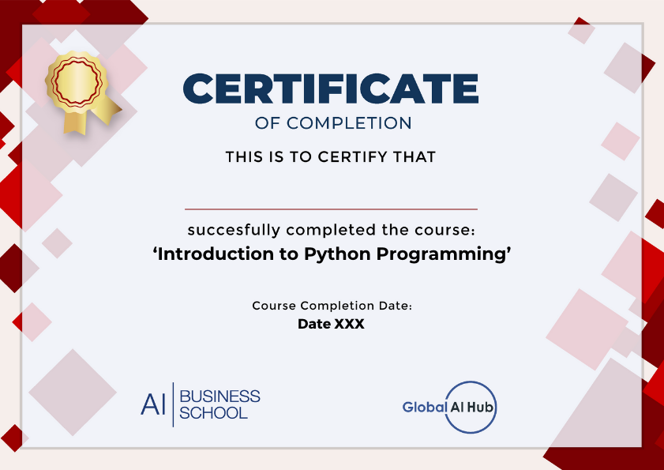

# GAIH Student Repo

**Course Date:** 01.02.2021 - 05.02.2021  
**Name:** PramudyaRilo  
**Surname:** Pambudi  
**Email:** pramudyarilo.p@gmail.com  

**Note:** Your homeworks can be formats like ".ipynb" and ".py". **Not ".txt" files!!** Make sure that your codes works.  

## Project Name
This repo is used for Python Course homework held by GlobalAI Hub

- You can find homework files in "homeworks" directory
- You can find final project files in "final_project" directory

## Syllabus

### Lesson 0
- What is Python?
- Comments
- Variables
- Data Types
- Arithmetic Operators

### Lesson 1
- Logical Operators and Comparison Operators
- Type Conversion
- Indexing and Slicing on Strings
- Membership Operators
- Lists

### Lesson 2
- If Conditions
- While Loop
- For Loop

### Lesson 3
- Dictionaries
- Sets
- Tuples

### Lesson 4
- Functions
- Return Statements
- Lambda Function
- *args and **kwargs
- Modules

### Lesson 5
- Try-Except
- Introduction to OOP
- Introduction to NumPy

## Certificate

